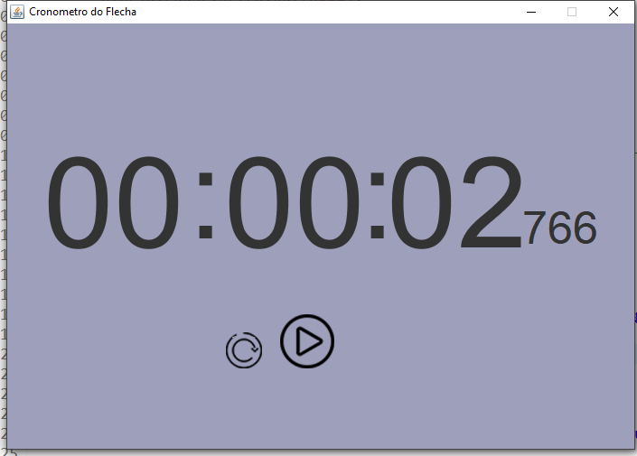
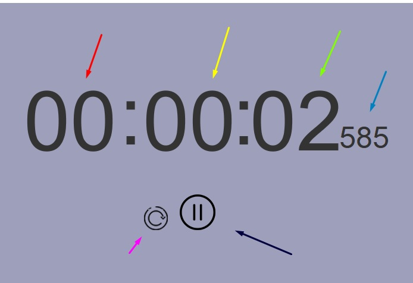
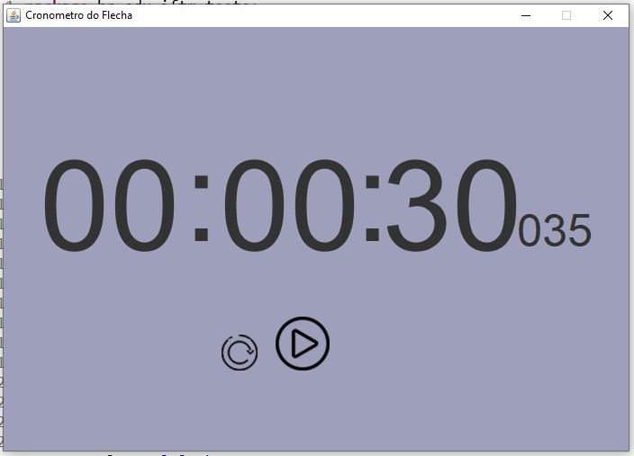

# Trabalho-CC-6P-PPD-2020-2

## Dupla
- Erick Silva
- Pedro Oliveira
## Descrição
O trabalho se baseia na ideia da criação de contador, similar aos contadores de relógio digitais como o do windows. Ao clicar no botão play ele iniciará a contagem do zero (caso a mesma esteja zerada) ou continuará a contagem do valor que estava pausado antes.

## Tecnologias usadas:
- Todo o projeto foi feito utilizando a linguagem java, com o uso de Threads, implementação de Runnable, o uso de imagens para os botões e o uso da biblioteca Swing (incluindo Border factory, ImageIcon, JButton, JFrame, JLabel, JPanel, etc.)

## Screenshots da tela
### Screenshot da tela inicial
 
- A imagem acima demonstra como a tela do programa funciona. 

### Screenshot detalhada
 
- A imagem acima demonstra com setas editadas pelos próprios membros do grupo, tornando fácil a diferenciação entre cada núcleo do programa. Temos respectivamente para as setas vermelha, amarela, verde, azul claro, azul escuro e rosa as representações de horas, minutos, segundos, miésimos, botão de pausa / play e botão de reset

### Screenshot de pause

- A imagem acima demonstra como o botão de play/pause muda quando o cronometro está pausado.

## Observações
Ainda temos alguns erros no trabalho, sendo eles:
- Sempre que o programa é pausado e dado play, ele abre uma nova janela, já que iniciamos uma nova thread com os dados salvos da anterior.
- O botão de reset não reseta o tempo caso o cronometro esteja pausado
